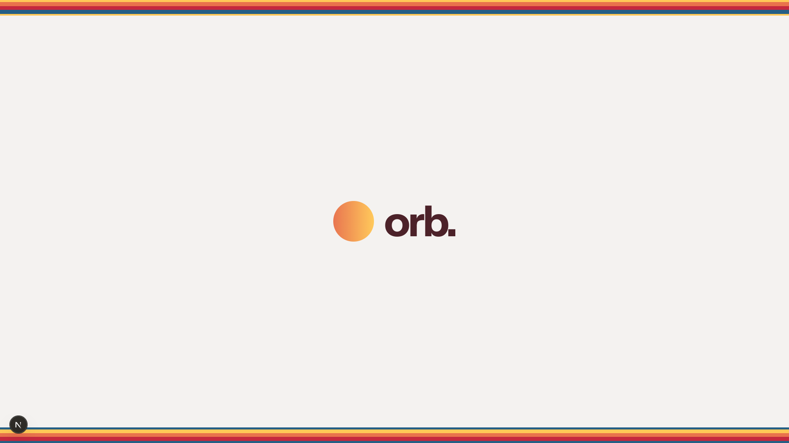
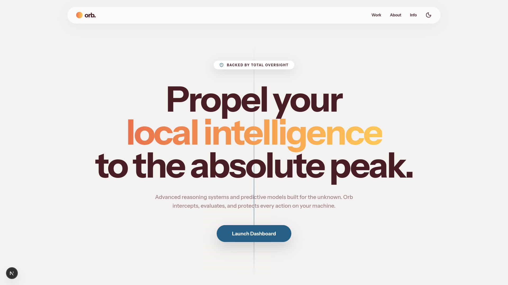
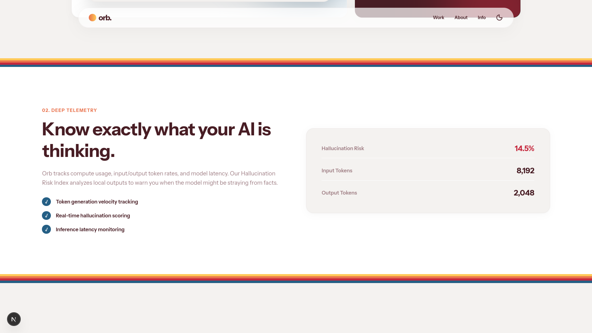
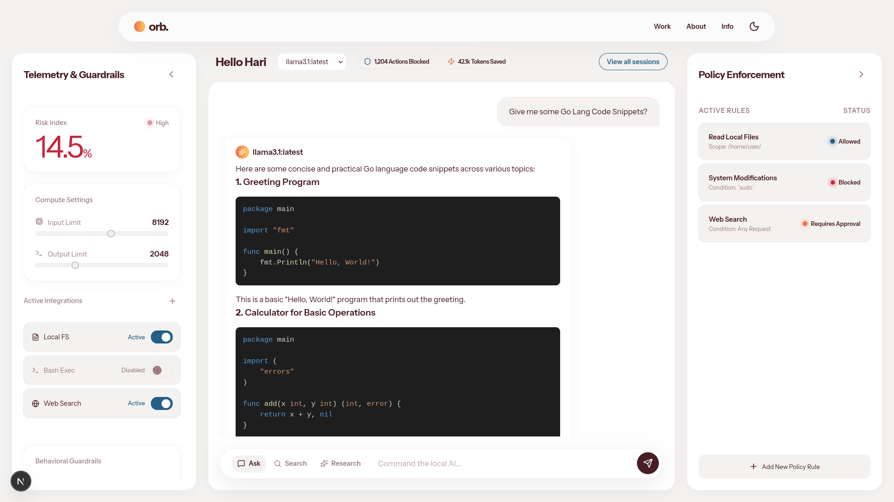
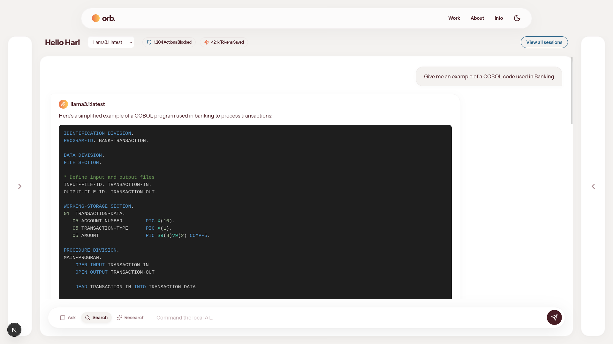

# Orb - Local AI Responsibility Layer

**Orb** is a web-based responsibility and oversight layer designed to interface with your local AI inference engines. It acts as an intelligent proxy that intercepts, evaluates, and protects every action your local models attempt to execute on your machine.

With Orb, you gain total oversight, local-first privacy, and granular guardrails wrapped in a breathtaking, cinematic user experience.



## Key Features

* **Telemetry & Guardrails**: Real-time tracking of hallucination risk and native configuration for input/output token limits. 
* **Command & Control**: A centralized chat interface to dispatch commands (Ask, Search, Research modes) with active monitoring of blocked actions and saved tokens.
* **Policy Enforcement**: Explicit, granular security policies that can allow, block, or require human approval for specific operations (e.g., executing `sudo` commands or reading local files).
* **Local-First Privacy**: Ensures no data arbitrarily leaves your machine, keeping your telemetry and operations strictly local.
* **Session History**: Detailed logs and telemetry breakdown for past inference sessions and automated tasks.




## Tech Stack

* **Framework:** Next.js (App Router) + React
* **Styling:** Pure vanilla CSS with dynamic CSS variables for fluid Light/Dark mode transitions.
* **Animations:** Framer Motion & GSAP for cinematic entry animations, smooth layout transitions, and micro-interactions.
* **Icons:** Lucide React



## Getting Started

```bash
cd frontend
npm install
npm run dev
```
Open [http://localhost:3000](http://localhost:3000) with your browser to see the result.
