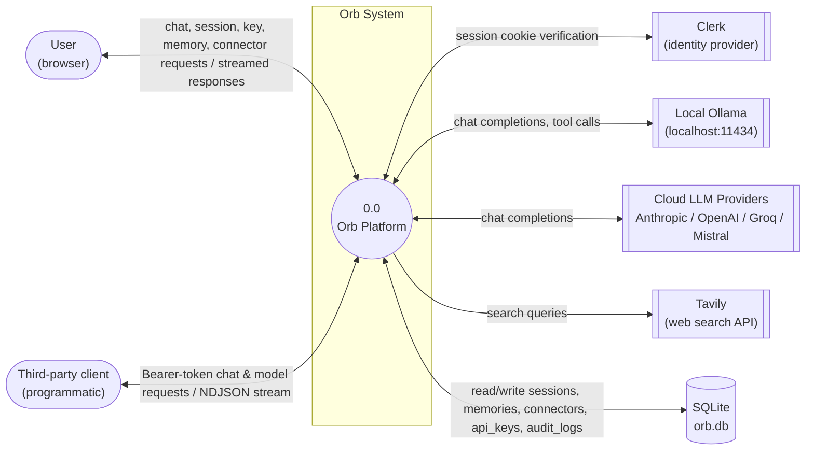
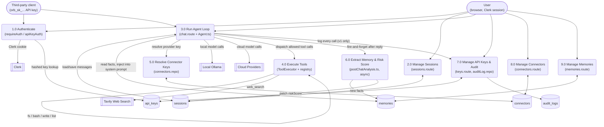

# Data Flow Diagrams

## Context Diagram (Level 0)

External entities, the system as a single process, and the data store it owns.

Mermaid source

## Level 1 — Process Decomposition

Breaks the single Orb process into its major functional processes and the data stores each one touches.

Mermaid source

### Process notes

| # | Process | Trigger | Reads | Writes |
|---|---|---|---|---|
| 1.0 | Authenticate | every request | Clerk session cookie, or `api_keys.key_hash` | — |
| 2.0 | Manage Sessions | session screen actions | `sessions` | `sessions` |
| 3.0 | Run Agent Loop | `POST /api/chat`, `POST /api/v1/chat` | `sessions`, `memories`, connector keys | `sessions.messages` |
| 4.0 | Execute Tools | tool call in agent loop, policy = Allowed | local fs/shell, Tavily API | local fs (write_file) |
| 5.0 | Resolve Connector Keys | any cloud LLM instantiation | `connectors` table, then `process.env` fallback | — |
| 6.0 | Extract Memory & Risk Score | async, after each chat reply | chat exchange (in memory) | `memories`, `sessions.messages[i].riskScore` |
| 7.0 | Manage API Keys & Audit | key CRUD, every `/api/v1/chat` call, analytics view | `api_keys`, `audit_logs` | `api_keys`, `audit_logs` |
| 8.0 | Manage Connectors | Connectors screen | `connectors` | `connectors` |
| 9.0 | Manage Memories | Memory screen | `memories` | `memories` |
