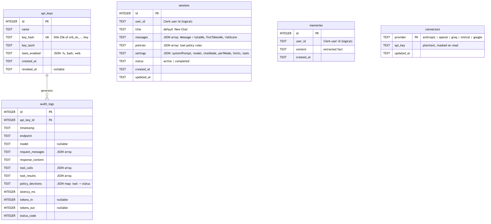
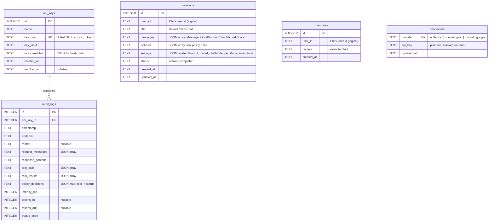

# Database Schema

SQLite (`better-sqlite3`, WAL mode), file `backend/data/orb.db`. Schema created in `backend/src/db/init.ts` via `CREATE TABLE IF NOT EXISTS`. No local `users` table — Clerk is the external identity source of truth; `user_id` columns are logical (unenforced) references to Clerk user IDs.

## Entity-Relationship Diagram

Mermaid source

## Notes

- **Only one enforced foreign key** in the whole schema: `audit_logs.api_key_id → api_keys(id)`.
- `sessions.user_id` and `memories.user_id` are **logical** references to Clerk's external user ID — there is no local `users` table, so referential integrity for those is not database-enforced.
- Indexes: `idx_memories_user (user_id)`, `idx_sessions_user (user_id)`, `idx_sessions_user_status (user_id, status)`.
- `connectors` is keyed by `provider` (not an autoincrement id) — one row per known provider, upserted on save. `KNOWN_PROVIDERS` (in `connectors.repo.ts`) lists 5 entries: `anthropic`, `openai`, `groq`, `mistral` (all `chatSupported: true`), and `google` (`chatSupported: false` — key storage only, no chat integration yet).
- Several JSON columns (`messages`, `settings`, `policies`, `tools_enabled`, `request_messages`, `tool_calls`, `tool_results`, `policy_decisions`) store structured data as serialized JSON text rather than normalized rows/tables — a deliberate denormalization for a single-writer, low-concurrency local app.
