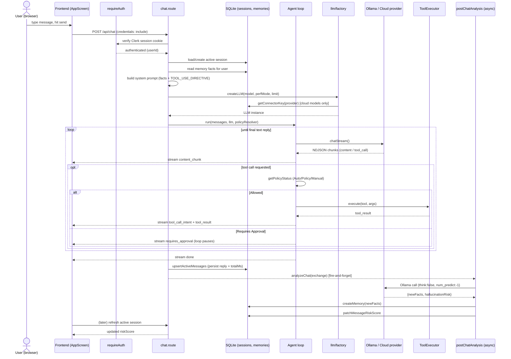
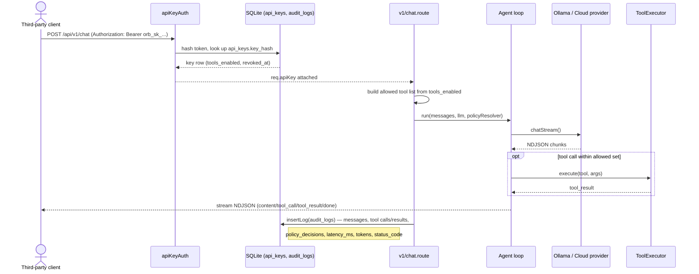
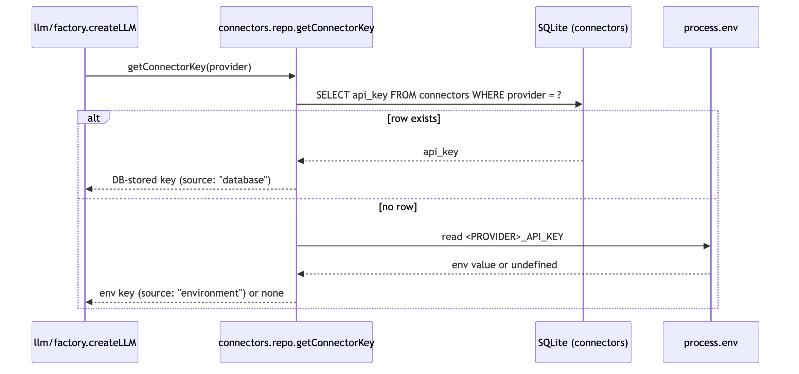
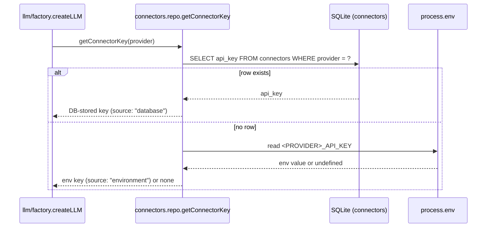

# Sequence Diagrams

## 1. Interactive chat (frontend, Clerk session cookie)

Mermaid source

## 2. Programmatic chat (`/api/v1/chat`, Bearer API key)

Mermaid source

## 3. Connector API-key resolution (cross-cutting)

Mermaid source

